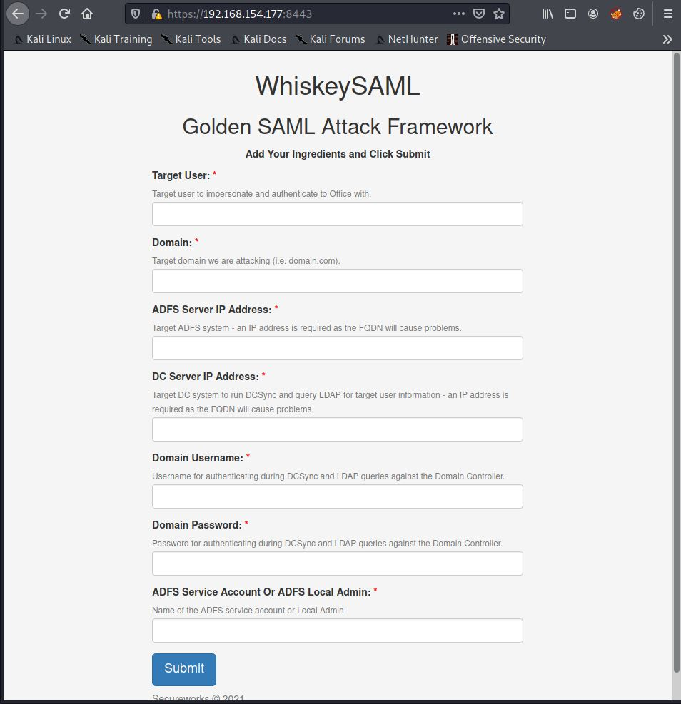

# WhiskeySAML

Proof of concept for a Golden SAML attack with Remote ADFS Configuration Extraction.

> Home page of WhiskeySAML where the user will enter the required data for the full attack.



> Once ADFS configuration has been pulled down and a Golden SAML ticket has been generated, the user can proceed with authenticating as the target user.


## PoC Demo


## Environment Setup

| Step | Instructions | Command |
|---   | ---          | ---     |
| 0 | When cloning this repo, ensure to clone with --recursive | `git clone --recursive <URL\|SSH>` |
| 1 | Install the required libraries on the server | `apt install libssl-dev wmi-client` |
| 2 | Install the Python virtual environment module | `pip3 install virtualenv` |
| 3 | Set up a Python virtual environment | `virtualenv venv` |
| 4 | Activate the Python Virtual environment | `source venv/bin/activate` |
| 5 | Install Pyhton requirements | `pip3 install -r requirements.txt` |

## Usage

> This tool has been successfully tested and run through proxychains.

```
usage: whiskeysaml.py [-h] [--port PORT] [--debug]

WhiskeySAML -- v0.1.0

optional arguments:
  -h, --help   show this help message and exit

  --port PORT  Port to run the HTTPS server on. Default: 8443

  --debug      Enable server debugging.
```

### Example

`python3 whiskeysaml.py --port 8443`

### How it Works

See the `TicketsPlease` module for details on ADFS configuration pull down and Goldem SAML token generation.

#### Requirements

* Minimal Account: Username and password for a domain account that has DCSync permissions
* Envrionment: Federated realm (ADFS)
  * IP address of Domain Controler and ADFS server

## Issues

* `wmi-client-wrapper-py3` has a known issue with Python 3.9.1 as the versioning is marked as `3.9.1+` which causes an error. If you run into the following error, please use another Python3 version:
    * `invalid literal for int() with base 10`
* After a number of tests, the ADFS service appears to begin failing (sending bad SCT envelopes) - this needs to be tested and dug into. A service restart fixes the issue.
